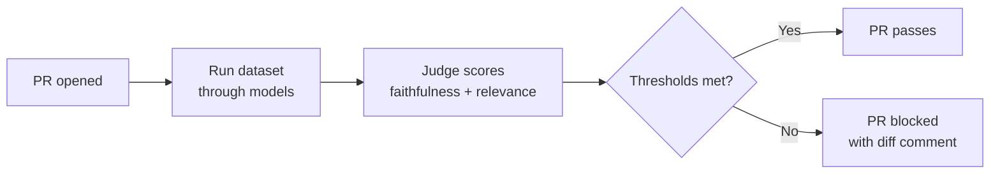

# mcp-llm-eval

[](https://pypi.org/project/mcp-llm-eval/)
[](https://www.python.org/downloads/)
[](LICENSE)

> **Status:** stable. Used in CI gates by [`mcp-content-pipeline`](https://github.com/berkayildi/mcp-content-pipeline) and [`meeting-agent`](https://github.com/berkayildi/meeting-agent). Live benchmarks at [llmshot.vercel.app](https://llmshot.vercel.app).

A local **Model Context Protocol (MCP) server** that packages LLM evaluation gates as reusable CI/CD primitives. Run datasets against multiple models, score responses with an LLM-as-judge, and enforce quality thresholds — all through MCP tools that AI agents can call.



---

## Why?

There's no unit test for LLM quality. Teams ship prompt changes, swap models, or update system prompts with no automated way to verify that output quality didn't regress. Manual spot-checking doesn't scale, and existing eval frameworks are heavy, opinionated, and hard to wire into CI/CD.

**mcp-llm-eval** gives AI agents structured access to a lightweight eval pipeline. Instead of building custom scripts for every project, you define a dataset, point the agent at it, and get scored results with pass/fail gates — the same workflow whether you're testing locally or gating a deployment.

---

## Role in ecosystem

mcp-llm-eval is the evaluation engine for a small ecosystem of repos:

- **Producers** that consume this library: [mcp-content-pipeline](https://github.com/berkayildi/mcp-content-pipeline), [meeting-agent](https://github.com/berkayildi/meeting-agent), and this repo itself (dogfoods its own engine on a self-defined dataset)
- **Data layer**: each producer writes benchmark JSON to [llm-benchmarks](https://github.com/berkayildi/llm-benchmarks)
- **Visualization**: [LLMShot](https://github.com/berkayildi/llmshot) renders all three domains live at [llmshot.vercel.app](https://llmshot.vercel.app)

This separation — engine here, golden datasets in the consuming repos, data and dashboard in dedicated public repos — means each producer defines its own quality bar without forking the engine.

---

## Features

| Tool                       | Description                                                                                                                                        |
| -------------------------- | -------------------------------------------------------------------------------------------------------------------------------------------------- |
| `run_evaluation`           | Load a dataset, query models via streaming, score with LLM-as-judge, return per-question scores and aggregate summary                              |
| `check_thresholds`         | Validate evaluation results against quality gates (faithfulness, relevance, TTFT, cost, retrieval, RAG)                                            |
| `list_evaluations`         | List past evaluation runs with metadata (timestamp, models, cost, pass/fail)                                                                       |
| `get_evaluation`           | Retrieve full details of a specific run (per-question scores, responses, judge reasoning)                                                          |
| `compare_runs`             | Compare two evaluation runs and detect regressions beyond configurable tolerance                                                                   |
| `format_pr_comment`        | Generate a markdown PR comment from evaluation results with regression details and threshold status                                                |
| `evaluate_retrieval`       | Run retrieval metrics (recall@k, precision@k, MRR, nDCG@k) against a labelled chunk dataset; returns per-query metrics, aggregate, p50/p95 latency |
| `evaluate_rag_end_to_end`  | Full RAG pipeline — retrieve, generate, score with `context_relevance` and `citation_faithfulness` judges                                          |
| `check_retrieval_drift`    | Compare two retrieval result files and flag metrics that regressed beyond tolerance                                                                |
| `simulate_poisoned_corpus` | Reserved stub; schema is stable today and returns a not-implemented response                                                                       |

### What it measures

Generation:

- **Faithfulness** (0-1) — Is the response grounded in the provided context?
- **Relevance** (0-1) — Does the response actually answer the question?
- **Time to First Token** — Streaming latency in milliseconds
- **Cost per Query** — Estimated cost based on token usage and provider pricing

Retrieval and RAG (v0.5.0):

- **Recall@k, Precision@k, MRR, nDCG@k** — Standard IR metrics against labelled `relevant_chunk_ids` (binary relevance)
- **Context relevance** (0-1) — LLM-as-judge score for each retrieved chunk against the query, averaged per query
- **Citation faithfulness** (0-1) — LLM-as-judge score for whether the generated answer is supported by the retrieved chunks
- **p50 / p95 retrieval latency** — Per-query timer wrapped around `adapter.retrieve()`

---

## Quick Start

### 1. Install

```bash
pip install mcp-llm-eval
```

Then install the provider SDKs you need (they are not bundled):

```bash
# Pick what you use
pip install anthropic    # for Claude models
pip install openai       # for GPT models + judge
pip install google-genai # for Gemini models
```

### 2. Configure Claude Desktop

Add this to your Claude Desktop MCP configuration file:

| OS      | Path                                                              |
| ------- | ----------------------------------------------------------------- |
| macOS   | `~/Library/Application Support/Claude/claude_desktop_config.json` |
| Windows | `%APPDATA%\Claude\claude_desktop_config.json`                     |

**Recommended — with `uvx` (no install required):**

```json
{
  "mcpServers": {
    "llm-eval": {
      "command": "uvx",
      "args": ["mcp-llm-eval"],
      "env": {
        "ANTHROPIC_API_KEY": "sk-ant-...",
        "OPENAI_API_KEY": "sk-...",
        "GOOGLE_API_KEY": "AIza..."
      }
    }
  }
}
```

> **Note:** Only include API keys for the providers you plan to evaluate. For example, if you only use Anthropic and OpenAI (for the judge), omit `GOOGLE_API_KEY`.

> **Note:** Claude Desktop may not inherit your terminal's `$PATH`. If the server fails to connect, use the absolute path to `uvx` (find it with `which uvx`):
>
> ```json
> {
>   "mcpServers": {
>     "llm-eval": {
>       "command": "/full/path/to/uvx",
>       "args": ["mcp-llm-eval"],
>       "env": {
>         "ANTHROPIC_API_KEY": "sk-ant-...",
>         "OPENAI_API_KEY": "sk-..."
>       }
>     }
>   }
> }
> ```

**Alternative — installed via pip:**

```json
{
  "mcpServers": {
    "llm-eval": {
      "command": "mcp-llm-eval",
      "env": {
        "ANTHROPIC_API_KEY": "sk-ant-...",
        "OPENAI_API_KEY": "sk-...",
        "GOOGLE_API_KEY": "AIza..."
      }
    }
  }
}
```

**Alternative — from source (virtualenv):**

```json
{
  "mcpServers": {
    "llm-eval": {
      "command": "/absolute/path/to/mcp-llm-eval/.venv/bin/python",
      "args": ["-m", "mcp_llm_eval.server"],
      "env": {
        "ANTHROPIC_API_KEY": "sk-ant-...",
        "OPENAI_API_KEY": "sk-...",
        "GOOGLE_API_KEY": "AIza..."
      }
    }
  }
}
```

### 3. Restart Claude Desktop

Fully quit (`Cmd+Q` on macOS) and reopen. Look for the tools icon to confirm the server is connected.

### 4. Ask a question

> "Run the eval dataset at `/path/to/dataset.json` against Claude Sonnet and GPT-4o, then check if faithfulness is above 0.8."

---

## Example interaction

Claude autonomously chains the tools — running the evaluation, then checking thresholds:

```
Running evaluation...
- Dataset: 9 questions (3 factual, 3 reasoning, 3 summarization)
- Models: claude-sonnet-4-6, gpt-4o-mini
- Judge: gpt-4o-mini

Results:
  claude-sonnet-4-6: avg faithfulness=0.83, relevance=0.83, TTFT=1367ms, cost=$0.0035/q
  gpt-4o-mini:       avg faithfulness=0.94, relevance=0.94, TTFT=1194ms, cost=$0.0001/q

Threshold check:
  avg_faithfulness >= 0.80: PASS (actual: 0.889)
  avg_relevance >= 0.75:    PASS (actual: 0.889)
  p95_ttft_ms <= 2000:      PASS (actual: 1367ms)
  max_cost_per_query <= 0.01: PASS (actual: $0.0035)

Overall: PASS

> Full benchmark across 8 models lives at https://llmshot.vercel.app (Eval Gates dataset).
```

---

## Configuration

Create an `.eval-gate.yml` in your project root for repeatable threshold configs:

```yaml
dataset: eval/dataset.json
corpus: eval/corpus.jsonl # v0.5.0 — used by retrieval / RAG eval
output_dir: eval/results

models:
  - provider: anthropic
    model: claude-sonnet-4-6
    input_cost_per_mtok: 3.0
    output_cost_per_mtok: 15.0
  - provider: openai
    model: gpt-4o-mini
    input_cost_per_mtok: 0.15
    output_cost_per_mtok: 0.60

judge:
  provider: openai
  model: gpt-4o-mini
  temperature: 0

retrieval: # v0.5.0
  adapter: bm25
  k: 5

thresholds:
  # generation
  avg_faithfulness: 0.80
  avg_relevance: 0.75
  p95_ttft_ms: 500
  max_cost_per_query: 0.01
  # retrieval (v0.5.0)
  avg_recall_at_k: 0.75
  avg_precision_at_k: 0.50
  avg_mrr: 0.70
  avg_ndcg_at_k: 0.75
  p95_retrieval_latency_ms: 50
  # RAG (v0.5.0)
  avg_context_relevance: 0.70
  avg_citation_faithfulness: 0.80
```

All v0.5.0 keys are optional. Existing v0.4.x configs continue to load and run unchanged — missing thresholds simply skip their check.

---

## Dataset schema

The evaluation dataset is a JSON array of entries:

```json
[
  {
    "id": "unique-id",
    "category": "factual",
    "context": "The system prompt / context provided to the model",
    "question": "The question asked",
    "expected_response": "Reference answer for the judge to compare against",
    "tags": ["optional", "tags"]
  }
]
```

Required fields: `id`, `category`, `context`, `question`, `expected_response`. The `tags` field is optional.

---

## Retrieval and RAG evaluation

v0.5.0 adds retrieval-only and end-to-end RAG evaluation alongside the v0.4.x generation eval. Datasets, configs, and tools from earlier versions continue to work unchanged.

### Dataset format (JSONL)

One entry per line. Add `relevant_chunk_ids` to mark the ground-truth chunks for each question:

```jsonl
{"id": "r-001", "category": "factual", "context": "Answer questions about JWST.", "question": "When did the James Webb Space Telescope launch?", "expected_response": "December 25, 2021.", "relevant_chunk_ids": ["sp-001"]}
{"id": "r-002", "category": "factual", "context": "Answer questions about JWST.", "question": "Where does JWST orbit and how big is its primary mirror?", "expected_response": "L2 Lagrange point; 6.5 metre primary mirror.", "relevant_chunk_ids": ["sp-002", "sp-004"]}
```

Entries without `relevant_chunk_ids` are skipped (with a stderr warning) by the retrieval and RAG commands.

### Corpus format (JSONL)

One chunk per line:

```jsonl
{"chunk_id": "sp-001", "content": "The James Webb Space Telescope launched on December 25, 2021 from French Guiana on an Ariane 5 rocket.", "metadata": {"topic": "space"}}
{"chunk_id": "sp-002", "content": "JWST orbits the Sun at the L2 Lagrange point, approximately 1.5 million kilometres from Earth.", "metadata": {"topic": "space"}}
{"chunk_id": "sp-004", "content": "The primary mirror of JWST is 6.5 metres across and is made of 18 hexagonal beryllium segments coated in gold.", "metadata": {"topic": "space"}}
```

`chunk_id` and `content` are required; `metadata` is an optional dict.

### CLI: retrieval-only

```bash
mcp-llm-eval evaluate-retrieval \
  --dataset eval/retrieval_dataset.jsonl \
  --corpus  eval/retrieval_corpus.jsonl \
  --k 5 \
  --output-dir eval/results
```

```
Retrieval evaluation: 20260425_120000
Queries: 4 | Errors: 0 | Adapter: bm25 | k=5

  Recall@k   Precision@k       MRR    nDCG@k    p50 ms    p95 ms
----------------------------------------------------------------
    0.8750        0.4500    0.9167    0.8431       3.2       7.8
```

Pass `--config .eval-gate.yml` to enforce thresholds post-run (exit code 1 on failure).

### CLI: end-to-end RAG

Shorthand form (one or more `--model provider:model` flags, repeatable):

```bash
mcp-llm-eval evaluate-rag \
  --dataset eval/retrieval_dataset.jsonl \
  --corpus  eval/retrieval_corpus.jsonl \
  --k 5 \
  --model openai:gpt-4o-mini \
  --model anthropic:claude-sonnet-4-6 \
  --output-dir eval/results
```

Or load models, judge, retrieval, and thresholds from `.eval-gate.yml`:

```bash
mcp-llm-eval evaluate-rag \
  --dataset eval/retrieval_dataset.jsonl \
  --corpus  eval/retrieval_corpus.jsonl \
  --config .eval-gate.yml
```

CLI `--model` flags fully override the config's `models:` list (no merging). Files written: `{timestamp}_rag_summary.json`, `{timestamp}_rag_benchmark.json`, `latest_rag_summary.json`.

### MCP tools

| Tool                       | Purpose                                                                                                 |
| -------------------------- | ------------------------------------------------------------------------------------------------------- |
| `evaluate_retrieval`       | Run retrieval metrics against a labelled dataset; returns per-query metrics, aggregate, p50/p95 latency |
| `evaluate_rag_end_to_end`  | Retrieve + generate + judge in one call; returns per-(query, model) results plus per-model aggregates   |
| `check_retrieval_drift`    | Compare two saved retrieval/RAG result files; flags metrics that regressed beyond tolerance             |
| `simulate_poisoned_corpus` | Reserved stub; schema is stable today and returns a not-implemented response                            |

### Pluggable retrievers

v0.5.0 shipped an in-memory `BM25Adapter` (via `rank_bm25`); v0.7.0 adds three embedding-based adapters. All implement the same `RetrievalAdapter` Protocol — a single sync method `retrieve(query, k) -> list[RetrievedChunk]` — so they're interchangeable behind `--adapter` and the eval-gate thresholds.

| Adapter         | Backing model              | Cost        | Notes                                                                       |
| --------------- | -------------------------- | ----------- | --------------------------------------------------------------------------- |
| `bm25`          | `rank_bm25` Okapi          | $0          | Lexical keyword match. Deterministic, model-agnostic, fits unit tests.      |
| `openai-small`  | `text-embedding-3-small`   | ~$0.02/1M   | Cheap dense vectors; corpus embeddings cached to `.embeddings-cache/`.      |
| `openai-large`  | `text-embedding-3-large`   | ~$0.13/1M   | Higher-quality dense vectors; same cache layout as `openai-small`.          |
| `google`        | `gemini-embedding-001`     | ~$0.15/1M   | Google's first-party embeddings. Batches automatically (100 inputs / req).  |

Embedding adapters lazy-import `openai` / `google-genai` / `numpy`. Install via `pip install "mcp-llm-eval[embeddings]"` to pull all three. Plug your own (Azure AI Search, OpenSearch, Pinecone) by subclassing the protocol; no schema or threshold changes required.

---

## Judge model configuration

The judge model is resolved in this order: explicit `--judge-model` CLI flag → `MCP_LLM_EVAL_JUDGE_MODEL` environment variable → built-in default `gpt-4o-mini`. All judge calls run at `temperature=0`.

The v0.5.0 judges (`context_relevance`, `citation_faithfulness`) prompt for an integer 1-5 score with anchor descriptions and normalise to a 0-1 float internally via `(score - 1) / 4`. Public APIs, eval-gate thresholds, and saved JSON all use the 0-1 form — the integer pipeline is an implementation detail for measurement reliability.

---

## Usage modes

### MCP agent

Connect to Claude Desktop or any MCP-compatible agent. The agent calls tools directly — run evals, check thresholds, browse past runs, compare runs, and generate PR comments.

### CLI

The same `mcp-llm-eval` binary doubles as a CLI for CI/CD pipelines:

```bash
# Run a full evaluation
mcp-llm-eval run --config .eval-gate.yml --dataset eval/dataset.json --output-dir eval/results

# Check thresholds (exit code 1 on failure — blocks PRs)
mcp-llm-eval check --results eval/results/latest_summary.json --config .eval-gate.yml

# Compare against baseline (exit code 1 on regression)
mcp-llm-eval compare --baseline eval/results/main_summary.json --current eval/results/pr_summary.json

# Generate PR comment markdown
mcp-llm-eval comment --summary eval/results/latest_summary.json --config .eval-gate.yml --output pr-comment.md

# Run retrieval-only evaluation (v0.5.0)
mcp-llm-eval evaluate-retrieval --dataset eval/retrieval_dataset.jsonl --corpus eval/retrieval_corpus.jsonl --k 5 --output-dir eval/results

# Run end-to-end RAG evaluation (v0.5.0)
mcp-llm-eval evaluate-rag --dataset eval/retrieval_dataset.jsonl --corpus eval/retrieval_corpus.jsonl --k 5 --model openai:gpt-4o-mini --output-dir eval/results
```

### GitHub Actions

```yaml
name: LLM Eval Gate

on:
  pull_request:

jobs:
  eval:
    runs-on: ubuntu-latest
    steps:
      - uses: actions/checkout@v4
      - uses: actions/setup-python@v5
        with:
          python-version: '3.12'
      - run: pip install mcp-llm-eval anthropic openai google-genai
      - run: mcp-llm-eval run --config .eval-gate.yml --dataset eval/dataset.json --output-dir eval/results
        env:
          ANTHROPIC_API_KEY: ${{ secrets.ANTHROPIC_API_KEY }}
          OPENAI_API_KEY: ${{ secrets.OPENAI_API_KEY }}
      - run: mcp-llm-eval check --results eval/results/latest_summary.json --config .eval-gate.yml
      - run: |
          mcp-llm-eval comment --summary eval/results/latest_summary.json --config .eval-gate.yml --output pr-comment.md
          gh pr comment ${{ github.event.number }} --body-file pr-comment.md
        env:
          GH_TOKEN: ${{ secrets.GITHUB_TOKEN }}
```

---

## Running benchmarks locally

mcp-llm-eval's own dataset (`eval/dataset.json`) dogfoods the
evaluation engine across 8 models, 20 questions, 3 categories
(factual, reasoning, summarization). The results feed into
[LLMShot](https://llmshot.vercel.app) as the Eval Gates benchmark.

Create a `.env` file in the project root with API keys for all
providers:

```
ANTHROPIC_API_KEY=sk-ant-...
OPENAI_API_KEY=sk-...
GOOGLE_API_KEY=AIza...
```

Then run:

```bash
make benchmark        # Run eval against all 8 models
make benchmark-copy   # Copy results to llm-benchmarks repo
```

Results are written to `eval/results/` (gitignored). The benchmark
output feeds into [LLMShot](https://llmshot.vercel.app) via the
[llm-benchmarks](https://github.com/berkayildi/llm-benchmarks) repo
at `text-generation/eval-gates-summary.json` and
`text-generation/eval-gates-benchmark.json`.

---

## Troubleshooting

**Server not appearing in Claude Desktop**

1. Ensure Claude Desktop is fully restarted (quit with `Cmd+Q`, not just close the window).
2. Check your config JSON is valid — a trailing comma or typo will silently break it.
3. Use absolute paths if `uvx` or `mcp-llm-eval` aren't found.

**"Provider SDK not installed" errors**

Provider SDKs are optional. Install the ones you need:

```bash
pip install anthropic openai google-genai
```

**"Dataset file not found" errors**

Use the full absolute path to your dataset file, not a relative path.

**Judge scoring fails**

The default judge uses OpenAI's `gpt-4o-mini`. Make sure the `openai` package is installed and `OPENAI_API_KEY` is set in your environment.

**This is Claude Desktop only**

MCP servers work with the Claude Desktop app, not claude.ai in your browser.

---

## Development

```bash
# Clone and set up
git clone https://github.com/berkayildi/mcp-llm-eval.git
cd mcp-llm-eval
make setup

# Run tests
make test

# Build distribution
make build

# Run the server locally (stdio)
make start

# Clean everything
make clean
```

---

## License

MIT © Berkay Yildirim
